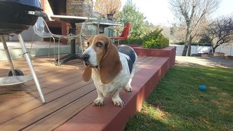

# transfer-learning
> Exploring ways to learn with the least amount of labelled data by taking advantage of transfer-learning techniques.

I've set myself the challenge to classify images of my 4 dogs using the least amount of training photos by exploring using transfer-learning techniques. I've got +-100 images of each dog - lets see how far we get. 

### Meet the dogs

   

Who wouldn't want to train on them? :-)


## Option 1: Fine-tune existing custom model

The idea is to fine-tune a model trained on a large publicly available data set. I chose the Kaggle cats vs. dogs data set with 25000 images (12500 cats, 12500 dogs) hoping that my model will learn enough about the features that are unique to dogs to be able to fine tune the model on a small set of images of my dogs.

### The Architecture

For the base model I am using a VGG-like architecture of 5 conv + max pool layers. 22500 images is used for training and the rest is hold out as a validation and test set. The model achieves 89% accuracy after training for about 20 epochs, but more importantly have learning features that are unique to dogs in general.


As can be seen from the diagram above the bottom 4 layers of the custom model are used, and a new conv + maxpool layer is added on top. The model then feeds into a fully connected layer with drop-out that finally feeds into a 4-class softmax layer for classification.


## Using the code

### Dependencies:

* Python 3.5
* numpy
* scikit-learn
* matplotlib
* tensorflow (1.1)

### Folder structure:

Create the following folder structure:


|transfer-learning (the source code lives here)

|

|----data (the train/test data lives here)

|

|----tf_logs (the TensorBoard logs lives here)

Download the cats vs. dogs dataset from [here](https://www.kaggle.com/c/dogs-vs-cats-redux-kernels-edition/data) and extract into a folder called *train* under the *data* folder.

### Train custom model

#### Start Tensorboard

In a terminal:

```
tensorboard --logdir tf_logs/
```

#### Train the model

In a terminal:

```
python3 train.py 
```

### Fine-Tune

## Release History

* 0.0.1
    * Work in progress


## Get in touch

Dries Cronje | [@dries139](twitter.com/dries139) | dries.cronje@outlook.com


