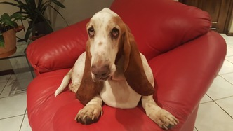

# transfer-learning
> Exploring ways to learn with the least amount of labelled data by taking advantage of transfer-learning techniques.

I've set myself the challenge to classify images of my dogs using the least amount of training photos using the latest in transfer-learning techniques. 

### Meet the dogs

   

Who wouldn't want to train on them? :-)


## Option 1: Fine-tune existing custom model

The idea is to fine-tune a model trained on a large publicly available data set. I chose the Kaggle cats vs. dogs data set with 25000 images (12500 cats, 12500 dogs) hoping that my model will learn enough about the features that are unique to dogs to be able to fine tune the model on a small set of my dog images.

### The Architecture

For the base model I have gone for a simple 5 layer convolutional neural network, each layer is made up of a convolutional layer followed by a max pool layer. Using 20000 of the training images you should be able to get about 85%+ accuracy before some serious overfitting kicks in.


As can be seen from the diagram the bottom 4 layers are transferred and locked, and fine-tuning is done on a single convolutional layer followed by a max pool layer feeding into a fully connected layer which in turn feeds into a 4-class softmax layer.


## Using the code

### Dependencies:

* Python 3.5
* numpy
* scikit-learn
* matplotlib
* tensorflow (1.1)

### Folder structure:

Create the following folder structure:


|transfer-learning (the source code lives here)

|

|----data (the train/test data lives here)

|

|----tf_logs (the TensorBoard logs lives here)

Download the cats vs. dogs dataset from [here](https://www.kaggle.com/c/dogs-vs-cats-redux-kernels-edition/data) and extract into a folder called *train* under the *data* folder.

### Train custom model

#### Start Tensorboard

In a terminal:

```
tensorboard --logdir tf_logs/
```

#### Train the model

In a terminal:

```
python3 train.py 
```

### Fine-Tune

## Release History

* 0.0.1
    * Work in progress


## Get in touch

Dries Cronje | [@dries139](twitter.com/dries139) | dries.cronje@outlook.com


