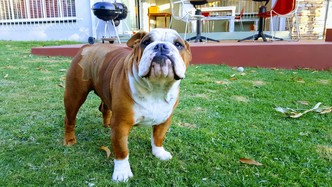
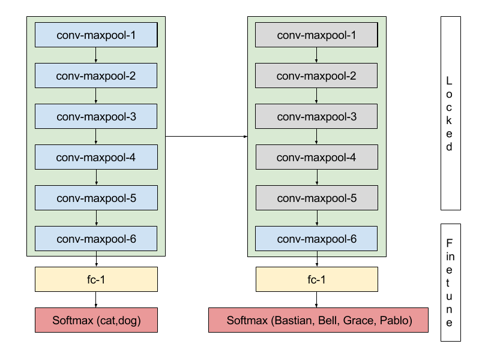

# transfer-learning
Exploring ways to learn with the least amount of labelled data by taking advantage of transfer-learning techniques.

I've set myself the challenge to classify images of my dogs using the least amount of training photos. 
To train a model based on a large freely available public dataset and to fine tune the model using the small dataset of my dogs is the first part of a 3 part series exploring different ways of using Transfer Learning to accomplish training with little data.

## Meet the dogs

   

Who wouldn't want to train on them? :-)

## Part 1: Fine-tune existing custom model

The idea is to fine-tune a model trained on a large publicly available data set. I chose the Kaggle cats vs. dogs data set with 25000 images (12500 cats, 12500 dogs) hoping that my model will learn enough about dogs to be able to fine tune the model on a small set of my dog images.

